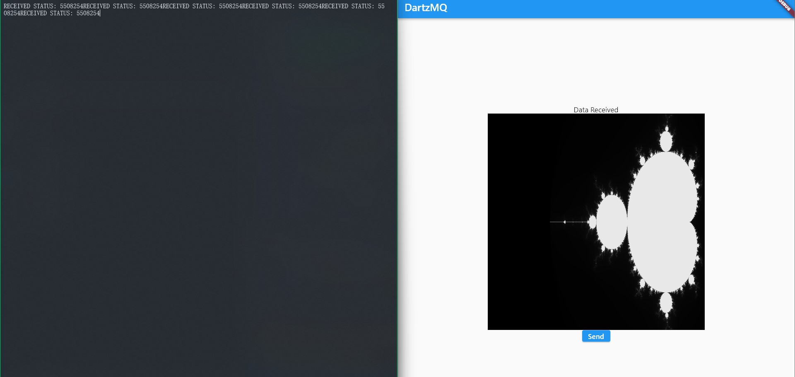

# C++ To Flutter Demo

This is a very rough demo of how to talk to a Flutter application from a C++ application via ZeroMQ pipelines for rendering stuff.

The inspiration was that I could not figure out how to create a UI in C++ but I really like the parallelisation frameworks around C++, i.e. SYCL, CUDA, etc. Besides, C++ is quite a bit faster than any of the more adopted languages.
But I also wanted a pretty UI around all this stuff. So that left Flutter. To get the best of both worlds, I decided to merge both C++ and Flutter.
I could consider using FlutterFlow as well to make apps faster on the frontend, so that's a plus!

This project demonstrates it by sending a mandelbrot image computed in C++ to Flutter using JSON and then converted to an Image type in flutter and then displayed to user.

The main code is in:
- Flutter: [\Flutter\lib\main.dart](/Flutter/lib/main.dart)
- C++: [Cpp\ConsoleApplication1\ConsoleApplication1.cpp](Cpp/ConsoleApplication1/ConsoleApplication1.cpp)

Rest all is filler for Flutter SDK and Visual Studio respectively

This project uses Pub-Sub connection over TCP localhost to transfer the image. There can be many more changes made to make the code more efficient and better:

- The actual rendering is slow
- I could use Protocol Buffer or some other better interchange format than JSON and consider compression to cutdown on transfer times
- I could use the IPC provided by ZeroMQ itself instead of using TCP over localhost to reduce transfer times.
- The deserializing and conversion to image is pretty slow on Flutter's side and can be parallelised.
- The send button doesn't actually do anything and the app looks horrible as a whole

But I'll fix these in the upcoming projects. This is more of a Proof Of Concept!
